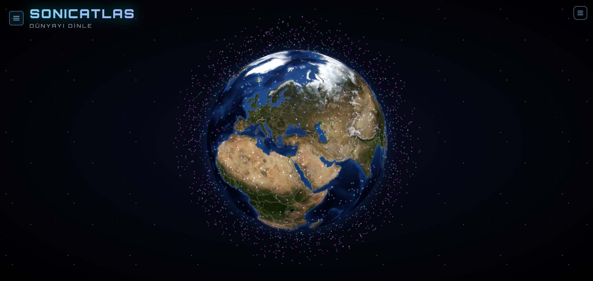

# 🌍 SonicAtlas - Listen to the World

**SonicAtlas** (formerly Radyocuyuzbiz) is an interactive 3D web application that allows you to explore and listen to thousands of live radio stations across the globe. Built with modern web technologies, it delivers an immersive audio-visual experience.

## 🌟 Features

*   **Interactive 3D Globe:** Explore 200+ countries with accurate coordinates and high-definition textures (Blue Marble).
*   **Live Radio Streaming:** Access over 30,000 live radio stations via the Radio Browser API.
*   **Immersive Visualizer:** Real-time 3D audio visualizer (`audioVisualizer.js`) with neon particles that react to bass, mids, and highs.
*   **Smart Search:** Filter stations by name, tag, or country instantly.
*   **Modern UI:** Glassmorphism design, smooth animations (Framer Motion), and responsive layout for mobile & desktop.
*   **Audio Enhancements:** Cross-fade transitions between stations and volume control.
*   **Localization:** Full Turkish and English language support.

## 🛠️ Tech Stack

*   **Frontend:** React 18, Vite
*   **3D/Graphics:** Three.js, React Globe.gl
*   **Audio:** Web Audio API (AnalyserNode), Tone.js (effects)
*   **State Management:** Zustand
*   **Styling:** CSS variables, Glassmorphism, Responsive Design
*   **Deployment:** Vercel (CI/CD, Analytics)

# 🌍 SonicAtlas - Dünyayı Dinle

**SonicAtlas** (eski adıyla Radyocuyuzbiz), dünya üzerindeki binlerce canlı radyo istasyonunu interaktif bir 3D dünya haritası üzerinden keşfetmenizi sağlayan modern bir web uygulamasıdır.

## 🌟 Özellikler

*   **İnteraktif 3D Küre:** 200'den fazla ülkeyi gerçek koordinatlarıyla keşfedin.
*   **Canlı Radyo Akışı:** Radio Browser API üzerinden 30.000+ radyo istasyonuna erişim.
*   **Görsel Şölen:** Müziğin ritmine ve frekansına göre tepki veren neon parçacıklı 3D ses görselleştirici.
*   **Akıllı Arama:** Radyo adı, türü veya ülkeye göre anlık filtreleme.
*   **Modern Arayüz:** Glassmorphism tasarım dili, akıcı geçişler ve mobil uyumlu yapı.
*   **Ses Geliştirmeleri:** Radyolar arası yumuşak geçiş (Cross-fade) özelliği.
*   **Dil Desteği:** Türkçe ve İngilizce seçenekleri.

## 🛠️ Teknolojiler

*   **Arayüz:** React 18, Vite
*   **3D Motoru:** Three.js, React Globe.gl
*   **Ses:** Web Audio API, Tone.js
*   **Durum Yönetimi:** Zustand
*   **Deployment:** Vercel

**License:** MIT
